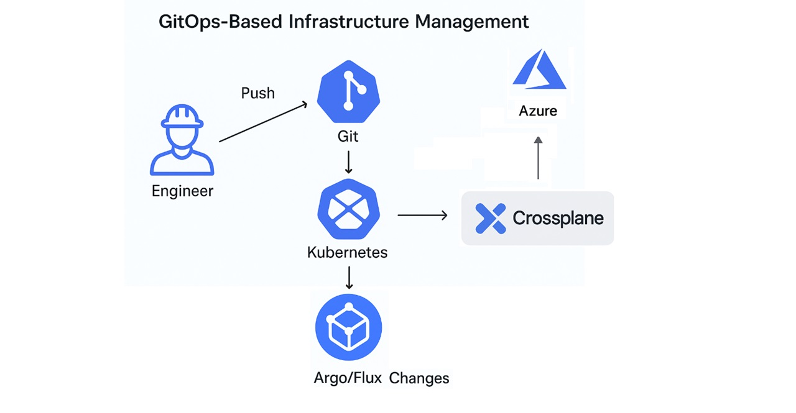
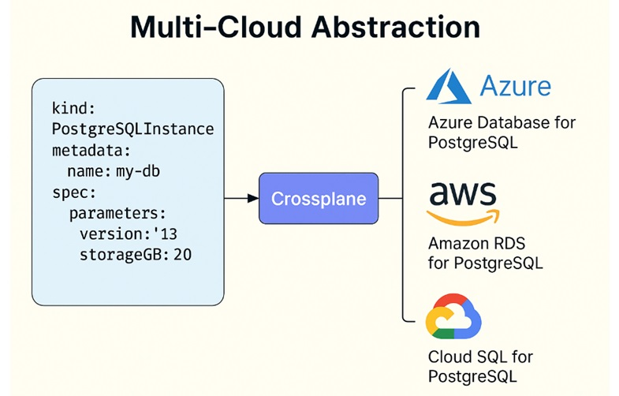
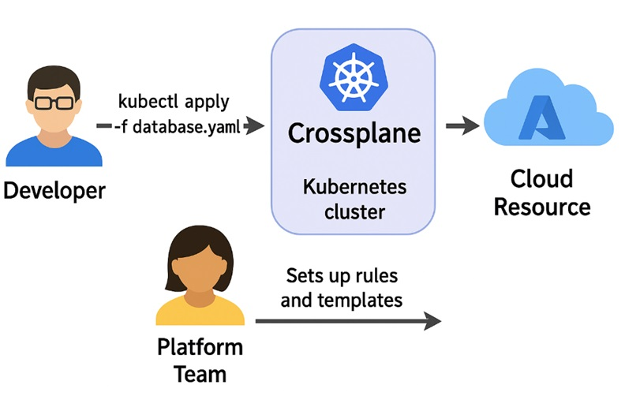
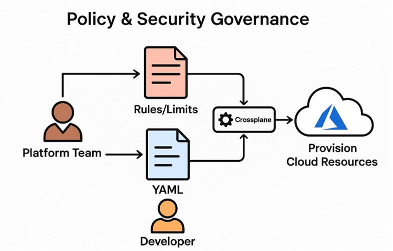

# Global Azure 2025: Crossplane powered Platform Engineering:-

Greetings and Welcome to another amazing Session in __Global Azure 2025 powered by Azure Zurich User Group.__

Discover how __Crossplane simplifies cloud infrastructure__.

Join me to learn more!

|  |  |
| --------- | --------- |

| Agenda:- |
| --------- |

| __#__ | __Topics__ |
| --------- | --------- |
| 1. | Introduction to Crossplane and its key feature. |
| 2. | Visual overview: Integration of Crossplane and Azure. |
| 3. | Crossplane Use case. |
| 4. | Setting up Crossplane with Azure. |
| 5. | Deploying Azure resources using Crossplane - Command-Line. |

| 01: Introduction to Crossplane and its key features:- |
| --------- |
|  |

| Defination:- |
| --------- |

Crossplane is a CNCF project that helps you manage cloud resources in a Kubernetes-native way. 
With Kubernetes, we used to manage only application, but with Crossplane, we can now manage cloud infrastructure.
For Ease of understanding, consider like this -
- With Crossplane, we can write a Kubernetes YAML file, and it will create the desired Cloud Resources (For Example - A Resource Group), directly from Kubernetes cluster.

| Reference Links:- |
| --------- |
- https://www.crossplane.io/
- https://docs.crossplane.io/latest/getting-started/introduction/

| Key Features:- |
| --------- |

| 02: Visual overview: Integration of Crossplane and Azure:- |
| --------- |
|  |

| 03: Crossplane Use cases:- |
| --------- |

| Primary Use case:- |
| --------- |
| Earlier Kubernetes was used only for Containerization and Deployment. Now with Crossplane, Kubernetes can be used to provision Infrastructure using same YAML file and apply it with kubectl. |

| Additional Use cases:- |
| --------- |

| I. GitOps-Based Infrastructure Management |
| --------- |
| Write YAML to describe cloud resources, push it to any Git repository, A tool like FluxCD or ArgoCD notices the change, informs Crossplane to create those resources |
|   |
| __II. Multi-Cloud Abstraction__ |
| One tool and one set of instructions to manage resources (not always true) across different cloud providers (like Azure, AWS, and GCP). |
|  |
| __III. Self-Service Platforms__ |
| The platform team (DevOps/SRE) sets up the rules, templates, and permissions using Crossplane. |
| A developer writes a small YAML file and runs using Kubectl. |
|  |
| __IV. Policy & Security Governance__ |
| Platform teams (DevOps or SREs) define "Compositions". These are like blueprints. |
| Platform teams also apply "constraints or limits". These are like Azure Policies (No Public IPs, Location is West Europe Only, VM Size... |
| Developer creates a resource using YAML. |
| Crossplane checks against these "constraints or limits". |
| Only allowed and safe resources are actually created in the cloud. |
|  |

| 04: Setting up Crossplane with Azure:- |
| --------- |

| Requirements:- |
| --------- |

1. An AKS Cluster (In Azure Cloud)
2. Kubectl (Installed in your working Notbook/VM)
3. Kubelogin (Installed in your working Notbook/VM)
4. Helm (Installed in your working Notbook/VM)

| AKS Cluster Details:- |
| --------- |

Subscription: __Visual Studio Enterprise Subscription__
Resource group: __AM-CrossPlane-RG__
Region: __West Europe__
Kubernetes cluster name: __AM-Crossplane-AKS__
Kubernetes version: __1.31.7__
Automatic upgrade: __patch__
Automatic upgrade scheduler: __Every week on Sunday (recommended)__
Node security channel type: __NodeImage__
Security channel scheduler: __Every week on Sunday (recommended)__
Node pools: __1__
Enable virtual nodes: __Disabled__
Resource identity: __System-assigned managed identity__
Local accounts: __Disabled__
Authentication and Authorization: __Microsoft Entra ID authentication with Azure RBAC__
Encryption type: __(Default) Encryption at-rest with a platform-managed key__
Private cluster: __Disabled__
Authorized IP ranges: __Disabled__
Network configuration: __Azure CNI Node Subnet__
Virtual network: __AM-CrossPlane-AKS-VNet__
Cluster subnet: __(new) Container-Subnet__
Kubernetes service address range: __10.0.0.0/16__
Kubernetes DNS service IP address: __10.0.0.10__
DNS name prefix: __AM-Crossplane-AKS-dns__
Network policy: __Azure__
Load balancer: __Standard__
Integrations: __Container registry__ 
resource group: __AM-CrossPlane-RG__
Container registry location: __West Europe__
Container registry admin user: __Enabled__
Container registry SKU: __Standard__
Container registry: __(new) AMCrossPlaneACR__
Service mesh: __Disabled__
Azure Policy: __Disabled__
Enable Container Logs: __Disabled__
Enable Prometheus metrics: __Enabled__
Azure Monitor workspace: __(new) AM-Azure-Monitor-Workspace-WEU__
Enable Grafana: __Disabled__
Alert rules: __2 rules__
Infrastructure resource group: __AM-CrossPlane-RG_AM-Crossplane-AKS_WestEurope__
Microsoft Defender for Cloud: __Free__
OpenID Connect (OIDC): __Enabled__
Workload Identity: __Enabled__
Image Cleaner: __Enabled__
Tags: __None__

| 05: Deploying Azure resources using Crossplane:- |
| --------- |
