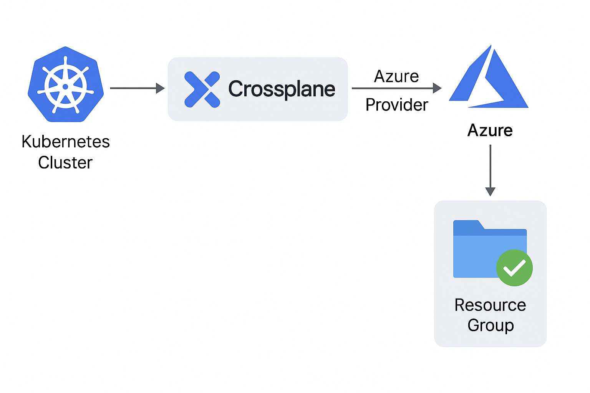

# Global Azure 2025: Crossplane powered Platform Engineering:-

Greetings and Welcome to another amazing Session in __Global Azure 2025 powered by Azure Zurich User Group.__

Discover how __Crossplane simplifies cloud infrastructure__.

Join me to learn more!

|  |  |
| --------- | --------- |

| Agenda:- |
| --------- |

| __#__ | __Topics__ |
| --------- | --------- |
| 1. | Introduction to Crossplane and its key features. |
| 2. | Visual overview: Integration of Crossplane and Azure. |
| 3. | Crossplane Use case. |
| 4. | Setting up Crossplane with Azure. |
| 5. | Deploying Azure resources using Crossplane - Command-Line. |
| 6. | Deploying Azure resources using Crossplane & Github Actions. |

| 01: Introduction to Crossplane and its key features:- |
| --------- |
|  |

| Defination in Simple English:- |
| --------- |

Crossplane is a CNCF project that helps you manage cloud resources in a Kubernetes-native way. 
With Kubernetes, we used to manage only application, but with Crossplane, we can now manage cloud infrastructure.
For Ease of understanding, consider like this -
- With Crossplane, we can write a Kubernetes YAML file, and it will create the desired Cloud Resources (For Example - A Resource Group), directly from Kubernetes cluster.

| Reference Links:- |
| --------- |
- https://www.crossplane.io/
- https://docs.crossplane.io/latest/getting-started/introduction/

| Key Features:- |
| --------- |

| 02: Visual overview: Integration of Crossplane and Azure:- |
| --------- |
|  |

