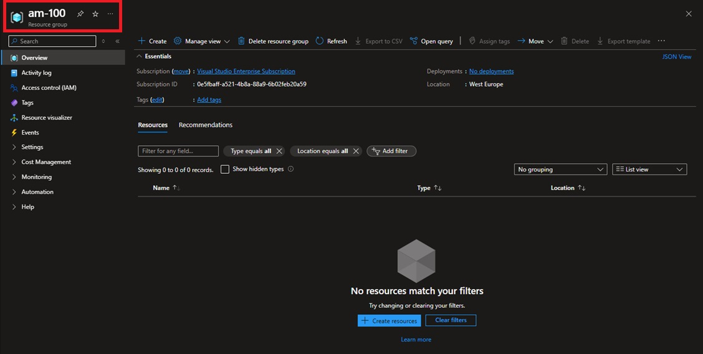

# Global Azure 2025: Crossplane powered Platform Engineering:-

Greetings and Welcome to another amazing Session in __Global Azure 2025 powered by Azure Zurich User Group.__

Discover how __Crossplane simplifies cloud infrastructure__.

Join me to learn more!

|  |  |
| --------- | --------- |

| Agenda:- |
| --------- |

| __#__ | __Topics__ |
| --------- | --------- |
| 1. | Introduction to Crossplane and its key feature. |
| 2. | Visual overview: Integration of Crossplane and Azure. |
| 3. | Crossplane Use case. |
| 4. | Setting up Crossplane with Azure. |
| 5. | Deploying Azure resources using Crossplane - Command-Line. |

| 01: Introduction to Crossplane and its key features:- |
| --------- |
|  |

| Defination:- |
| --------- |

Crossplane is a CNCF project that helps you manage cloud resources in a Kubernetes-native way. 
With Kubernetes, we used to manage only application, but with Crossplane, we can now manage cloud infrastructure.
For Ease of understanding, consider like this -
- With Crossplane, we can write a Kubernetes YAML file, and it will create the desired Cloud Resources (For Example - A Resource Group), directly from Kubernetes cluster.

| Reference Links:- |
| --------- |
- https://www.crossplane.io/
- https://docs.crossplane.io/latest/getting-started/introduction/

| Key Features:- |
| --------- |


| 02: Visual overview: Integration of Crossplane and Azure:- |
| --------- |
|  |


| 03: Crossplane Use cases:- |
| --------- |

| Primary Use case:- |
| --------- |
| Earlier Kubernetes was used only for Containerization and Deployment. Now with Crossplane, Kubernetes can be used to provision Infrastructure using same YAML file and apply it with kubectl. |

| Additional Use cases:- |
| --------- |

| I. GitOps-Based Infrastructure Management |
| --------- |
| Write YAML to describe cloud resources, push it to any Git repository, A tool like FluxCD or ArgoCD notices the change, informs Crossplane to create those resources |
|   |
| __II. Multi-Cloud Abstraction__ |
| One tool and one set of instructions to manage resources (not always true) across different cloud providers (like Azure, AWS, and GCP). |
|  |
| __III. Self-Service Platforms__ |
| The platform team (DevOps/SRE) sets up the rules, templates, and permissions using Crossplane. |
| A developer writes a small YAML file and runs using Kubectl. |
|  |
| __IV. Policy & Security Governance__ |
| Platform teams (DevOps or SREs) define "Compositions". These are like blueprints. |
| Platform teams also apply "constraints or limits". These are like Azure Policies (No Public IPs, Location is West Europe Only, VM Size... |
| Developer creates a resource using YAML. |
| Crossplane checks against these "constraints or limits". |
| Only allowed and safe resources are actually created in the cloud. |
|  |

| 04: Setting up Crossplane with Azure:- |
| --------- |

| Requirements:- |
| --------- |

1. An AKS Cluster (In Azure Cloud)
2. Kubectl (Installed in your working Notbook/VM)
3. Kubelogin (Installed in your working Notbook/VM)
4. Helm (Installed in your working Notbook/VM)

| AKS Cluster Details:- |
| --------- |

- Subscription: __Visual Studio Enterprise Subscription__
- Resource group: __AM-CrossPlane-RG__
- Region: __West Europe__
- Kubernetes cluster name: __AM-Crossplane-AKS__
- Kubernetes version: __1.31.7__
- Automatic upgrade: __patch__
- Automatic upgrade scheduler: __Every week on Sunday (recommended)__
- Node security channel type: __NodeImage__
- Security channel scheduler: __Every week on Sunday (recommended)__
- Node pools: __1__
- Enable virtual nodes: __Disabled__
- Resource identity: __System-assigned managed identity__
- Local accounts: __Disabled__
- Authentication and Authorization: __Microsoft Entra ID authentication with Azure RBAC__
- Encryption type: __(Default) Encryption at-rest with a platform-managed key__
- Private cluster: __Disabled__
- Authorized IP ranges: __Disabled__
- Network configuration: __Azure CNI Node Subnet__
- Virtual network: __AM-CrossPlane-AKS-VNet__
- Cluster subnet: __(new) Container-Subnet__
- Kubernetes service address range: __10.0.0.0/16__
- Kubernetes DNS service IP address: __10.0.0.10__
- DNS name prefix: __AM-Crossplane-AKS-dns__
- Network policy: __Azure__
- Load balancer: __Standard__
- Integrations: __Container registry__ 
- resource group: __AM-CrossPlane-RG__
- Container registry location: __West Europe__
- Container registry admin user: __Enabled__
- Container registry SKU: __Standard__
- Container registry: __(new) AMCrossPlaneACR__
- Service mesh: __Disabled__
- Azure Policy: __Disabled__
- Enable Container Logs: __Disabled__
- Enable Prometheus metrics: __Enabled__
- Azure Monitor workspace: __(new) AM-Azure-Monitor-Workspace-WEU__
- Enable Grafana: __Disabled__
- Alert rules: __2 rules__
- Infrastructure resource group: __AM-CrossPlane-RG_AM-Crossplane-AKS_WestEurope__
- Microsoft Defender for Cloud: __Free__
- OpenID Connect (OIDC): __Enabled__
- Workload Identity: __Enabled__
- Image Cleaner: __Enabled__
- Tags: __None__

| Windows System on which below application was Installed ? |
| --------- |
| Microsoft Windows Server 2022 Datacenter Azure Edition. |

I. __Install Kubectl on Windows.__

| Reference Link: https://community.chocolatey.org/packages/kubernetes-cli |
| --------- |

```
choco install kubernetes-cli
```

| Kubectl Installation Logs:- |
| --------- |

```
PS C:\Users\amadmin> choco install kubernetes-cli

Chocolatey v2.4.3
Installing the following packages:
kubernetes-cli
By installing, you accept licenses for the packages.
Downloading package from source 'https://community.chocolatey.org/api/v2/'
Progress: Downloading kubernetes-cli 1.33.0... 100%

kubernetes-cli v1.33.0 [Approved]
kubernetes-cli package files install completed. Performing other installation steps.
The package kubernetes-cli wants to run 'chocolateyInstall.ps1'.
Note: If you don't run this script, the installation will fail.
Note: To confirm automatically next time, use '-y' or consider:
choco feature enable -n allowGlobalConfirmation
Do you want to run the script?([Y]es/[A]ll - yes to all/[N]o/[P]rint): A

Extracting 64-bit C:\ProgramData\chocolatey\lib\kubernetes-cli\tools\kubernetes-client-windows-amd64.tar.gz to C:\ProgramData\chocolatey\lib\kubernetes-cli\tools...
C:\ProgramData\chocolatey\lib\kubernetes-cli\tools
Extracting 64-bit C:\ProgramData\chocolatey\lib\kubernetes-cli\tools\kubernetes-client-windows-amd64.tar to C:\ProgramData\chocolatey\lib\kubernetes-cli\tools...
C:\ProgramData\chocolatey\lib\kubernetes-cli\tools
 ShimGen has successfully created a shim for kubectl-convert.exe
 ShimGen has successfully created a shim for kubectl.exe
 The install of kubernetes-cli was successful.
  Deployed to 'C:\ProgramData\chocolatey\lib\kubernetes-cli\tools'

Chocolatey installed 1/1 packages.
 See the log for details (C:\ProgramData\chocolatey\logs\chocolatey.log).

PS C:\Users\amadmin>

```

| Validate Post Installation:- |
| --------- |

```
PS C:\Users\amadmin> kubectl version --client
Client Version: v1.33.0
Kustomize Version: v5.6.0
PS C:\Users\amadmin>
```

II. __Install kubelogin on Windows.__

| Reference Link:  |
| --------- |

```

```

| Kubelogin ERROR Logs:- |
| --------- |

```
```


III. __Install Helm on Windows.__

| Reference Link: https://community.chocolatey.org/packages/kubernetes-helm |
| --------- |

```
choco install kubernetes-helm
```

| Kubectl Installation Logs:- |
| --------- |

```
PS C:\Users\amadmin> choco install kubernetes-helm
Chocolatey v2.4.3
Installing the following packages:
kubernetes-helm
By installing, you accept licenses for the packages.
Downloading package from source 'https://community.chocolatey.org/api/v2/'
Progress: Downloading kubernetes-helm 3.17.3... 100%

kubernetes-helm v3.17.3 [Approved]
kubernetes-helm package files install completed. Performing other installation steps.
The package kubernetes-helm wants to run 'chocolateyInstall.ps1'.
Note: If you don't run this script, the installation will fail.
Note: To confirm automatically next time, use '-y' or consider:
choco feature enable -n allowGlobalConfirmation
Do you want to run the script?([Y]es/[A]ll - yes to all/[N]o/[P]rint): A

Downloading kubernetes-helm 64 bit
  from 'https://get.helm.sh/helm-v3.17.3-windows-amd64.zip'
Progress: 100% - Completed download of C:\Users\amadmin\AppData\Local\Temp\2\chocolatey\kubernetes-helm\3.17.3\helm-v3.17.3-windows-amd64.zip (17.09 MB).
Download of helm-v3.17.3-windows-amd64.zip (17.09 MB) completed.
Hashes match.
Extracting C:\Users\amadmin\AppData\Local\Temp\2\chocolatey\kubernetes-helm\3.17.3\helm-v3.17.3-windows-amd64.zip to C:\ProgramData\chocolatey\lib\kubernetes-helm\tools...
C:\ProgramData\chocolatey\lib\kubernetes-helm\tools
 ShimGen has successfully created a shim for helm.exe
 The install of kubernetes-helm was successful.
  Deployed to 'C:\ProgramData\chocolatey\lib\kubernetes-helm\tools'

Chocolatey installed 1/1 packages.
 See the log for details (C:\ProgramData\chocolatey\logs\chocolatey.log).
PS C:\Users\amadmin>
PS C:\Users\amadmin>

```

| Validate Post Installation:- |
| --------- |

```
PS C:\Users\amadmin> helm version
version.BuildInfo{Version:"v3.17.3", GitCommit:"e4da49785aa6e6ee2b86efd5dd9e43400318262b", GitTreeState:"clean", GoVersion:"go1.23.7"}
PS C:\Users\amadmin>
```

Step 1: __Install Crossplane into your Kubernetes Cluster:-__

> kubectl create namespace am-crossplane
```
PS C:\Users\amadmin> kubectl create namespace am-crossplane
namespace/am-crossplane created
PS C:\Users\amadmin>
```
> kubectl get namespace
```
PS C:\Users\amadmin> kubectl get namespace
NAME              STATUS   AGE
am-crossplane     Active   18s
default           Active   3h15m
kube-node-lease   Active   3h15m
kube-public       Active   3h15m
kube-system       Active   3h15m
PS C:\Users\amadmin>
```

> helm repo add crossplane-stable https://charts.crossplane.io/stable
```
PS C:\Users\amadmin> helm repo add crossplane-stable https://charts.crossplane.io/stable
"crossplane-stable" has been added to your repositories
PS C:\Users\amadmin>
```

> helm repo update
```
PS C:\Users\amadmin> helm repo update
Hang tight while we grab the latest from your chart repositories...
...Successfully got an update from the "crossplane-stable" chart repository
Update Complete. ⎈Happy Helming!⎈
PS C:\Users\amadmin>
```

> helm install crossplane crossplane-stable/crossplane --namespace am-crossplane
```
PS C:\Users\amadmin> helm install crossplane crossplane-stable/crossplane --namespace am-crossplane
NAME: crossplane
LAST DEPLOYED: Thu May  8 09:19:30 2025
NAMESPACE: am-crossplane
STATUS: deployed
REVISION: 1
TEST SUITE: None
NOTES:
Release: crossplane

Chart Name: crossplane
Chart Description: Crossplane is an open source Kubernetes add-on that enables platform teams to assemble infrastructure from multiple vendors, and expose higher level self-service APIs for application teams to consume.
Chart Version: 1.19.1
Chart Application Version: 1.19.1

Kube Version: v1.31.7
PS C:\Users\amadmin>
```

> kubectl get pods -n am-crossplane
```
PS C:\Users\amadmin> kubectl get pods -n am-crossplane
NAME                                       READY   STATUS    RESTARTS   AGE
crossplane-66f8c4f6f8-7nkzt                1/1     Running   0          47s
crossplane-rbac-manager-564687c9dd-7qlns   1/1     Running   0          47s
PS C:\Users\amadmin>
```

> kubectl get deployments -n am-crossplane
```
PS C:\Users\amadmin> kubectl get deployments -n am-crossplane
NAME                      READY   UP-TO-DATE   AVAILABLE   AGE
crossplane                1/1     1            1           4m17s
crossplane-rbac-manager   1/1     1            1           4m17s
PS C:\Users\amadmin>
```

Step 2: __Install the Azure Provider:-__

__The Crossplane Provider installs the Kubernetes Custom Resource Definitions (CRDs) representing Azure Networking services. These CRDs allow you to create Azure resources directly inside Kubernetes.__

__provider.yaml:-__
```
apiVersion: pkg.crossplane.io/v1
kind: Provider
metadata:
  name: provider-azure-network
spec:
  package: xpkg.crossplane.io/crossplane-contrib/provider-azure-network:v1.11.2
```

> kubectl get providers
```
PS C:\Users\amadmin> kubectl get providers
No resources found
PS C:\Users\amadmin>
```

> kubectl apply -f provider.yaml
```
PS C:\Users\amadmin> cd .\Desktop\
PS C:\Users\amadmin\Desktop> cd .\Crossplane\
PS C:\Users\amadmin\Desktop\Crossplane>
PS C:\Users\amadmin\Desktop\Crossplane> ls


    Directory: C:\Users\amadmin\Desktop\Crossplane


Mode                 LastWriteTime         Length Name
----                 -------------         ------ ----
-a----          5/8/2025   9:33 AM            179 provider.yaml


PS C:\Users\amadmin\Desktop\Crossplane>
PS C:\Users\amadmin\Desktop\Crossplane> kubectl apply -f provider.yaml
provider.pkg.crossplane.io/provider-azure-network created
PS C:\Users\amadmin\Desktop\Crossplane>
```

> kubectl get providers
```
PS C:\Users\amadmin\Desktop\Crossplane> kubectl get providers
NAME                                       INSTALLED   HEALTHY   PACKAGE                                                                AGE
crossplane-contrib-provider-family-azure   True        True      xpkg.crossplane.io/crossplane-contrib/provider-family-azure:v1.11.2    32s
provider-azure-network                     True        True      xpkg.crossplane.io/crossplane-contrib/provider-azure-network:v1.11.2   37s
PS C:\Users\amadmin\Desktop\Crossplane>
```

Step 3: __Create an Azure Service Principal:-__

> az ad sp create-for-rbac --sdk-auth --role Owner --scopes /subscriptions/xxxxxxxxxxxxxxxxxxxxxxxxxxxxxx
```
PS C:\Users\amadmin\Desktop\Crossplane> az ad sp create-for-rbac --sdk-auth --role Owner --scopes /subscriptions/xxxxxxxxxxxxxxxxxxxxxxxxxxxxxx
Option '--sdk-auth' has been deprecated and will be removed in a future release.
Creating 'Owner' role assignment under scope '/subscriptions/0e5fbaff-a521-4b8a-88a9-6b02feb20a59'
The output includes credentials that you must protect. Be sure that you do not include these credentials in your code or check the credentials into your source control. For more information, see https://aka.ms/azadsp-cli
{
  "clientId": "xxxxxxxxxxxxxxxxxxxxxxxxxxxxxxxxxxxxxxxxxx",
  "clientSecret": "xxxxxxxxxxxxxxxxxxxxxxxxxxxxxxxxxxxxxxxxxx",
  "subscriptionId": "xxxxxxxxxxxxxxxxxxxxxxxxxxxxxxxxxxxxxxxxxx",
  "tenantId": "xxxxxxxxxxxxxxxxxxxxxxxxxxxxxxxxxxxxxxxxxx",
  "activeDirectoryEndpointUrl": "https://login.microsoftonline.com",
  "resourceManagerEndpointUrl": "https://management.azure.com/",
  "activeDirectoryGraphResourceId": "https://graph.windows.net/",
  "sqlManagementEndpointUrl": "https://management.core.windows.net:8443/",
  "galleryEndpointUrl": "https://gallery.azure.com/",
  "managementEndpointUrl": "https://management.core.windows.net/"
}
PS C:\Users\amadmin\Desktop\Crossplane>
```

🔥 Important Note: __Save your Azure JSON output as "azure-credentials.json".__

Step 4: __Create a Kubernetes secret with the Azure credentials:-__ 

__A Kubernetes generic secret has a name and contents. kubectl create secret will generate the secret object named "azure-secret" in the am-crossplane namespace. "--from-file=" argument is used to set the contents of the azure-credentials.json file.__

> kubectl create secret generic azure-secret -n am-crossplane --from-file=creds=./azure-credentials.json
```
PS C:\Users\amadmin\Desktop\Crossplane> kubectl create secret generic azure-secret -n am-crossplane --from-file=creds=./azure-credentials.json
secret/azure-secret created
PS C:\Users\amadmin\Desktop\Crossplane>
```

> kubectl describe secret azure-secret -n am-crossplane
```
PS C:\Users\amadmin\Desktop\Crossplane> kubectl describe secret azure-secret -n am-crossplane
Name:         azure-secret
Namespace:    am-crossplane
Labels:       <none>
Annotations:  <none>

Type:  Opaque

Data
====
creds:  661 bytes
PS C:\Users\amadmin\Desktop\Crossplane>
```

Step 5: __Create Provider Config:-__ 

__Customize the settings of Azure Provider.__

__providerconfig.yaml:-__
```
apiVersion: azure.upbound.io/v1beta1
metadata:
  name: am-azure-provider-config
kind: ProviderConfig
spec:
  credentials:
    source: Secret
    secretRef:
      namespace: am-crossplane
      name: azure-secret
      key: creds
```

> kubectl apply -f providerconfig.yaml
```
PS C:\Users\amadmin\Desktop\Crossplane> kubectl apply -f providerconfig.yaml
providerconfig.azure.upbound.io/am-azure-provider-config created
PS C:\Users\amadmin\Desktop\Crossplane>
```

| 05: Deploying Azure resources using Crossplane:- |
| --------- |

__rg.yaml:-__
```
apiVersion: azure.crossplane.io/v1alpha3
kind: ResourceGroup
metadata:
  name: am-100
spec:
  forProvider:
    location: West Europe
  providerConfigRef:
    name: am-azure-provider-config
```
> kubectl apply -f rg.yaml

| Below Follows the ERROR Logs:- |
| --------- | 

```
PS C:\Users\amadmin\Desktop\Crossplane> kubectl apply -f rg.yaml
error: resource mapping not found for name: "am-100" namespace: "" from "rg.yaml": no matches for kind "ResourceGroup" in version "azure.crossplane.io/v1alpha3"
ensure CRDs are installed first
PS C:\Users\amadmin\Desktop\Crossplane>
```

| Troubleshooting:- |
| --------- | 

Ensure CRDs are installed.

> kubectl get crds
```
PS C:\Users\amadmin> kubectl get crds
NAME                                                                            CREATED AT
applicationgateways.network.azure.upbound.io                                    2025-05-08T09:36:05Z
applicationsecuritygroups.network.azure.upbound.io                              2025-05-08T09:36:04Z
bastionhosts.network.azure.upbound.io                                           2025-05-08T09:36:04Z
compositeresourcedefinitions.apiextensions.crossplane.io                        2025-05-08T09:19:39Z
compositionrevisions.apiextensions.crossplane.io                                2025-05-08T09:19:39Z
compositions.apiextensions.crossplane.io                                        2025-05-08T09:19:39Z
configurationrevisions.pkg.crossplane.io                                        2025-05-08T09:19:39Z
configurations.pkg.crossplane.io                                                2025-05-08T09:19:39Z
connectionmonitors.network.azure.upbound.io                                     2025-05-08T09:36:05Z
controllerconfigs.pkg.crossplane.io                                             2025-05-08T09:19:39Z
ddosprotectionplans.network.azure.upbound.io                                    2025-05-08T09:36:04Z
deploymentruntimeconfigs.pkg.crossplane.io                                      2025-05-08T09:19:40Z
dnsaaaarecords.network.azure.upbound.io                                         2025-05-08T09:36:04Z
dnsarecords.network.azure.upbound.io                                            2025-05-08T09:36:04Z
dnscaarecords.network.azure.upbound.io                                          2025-05-08T09:36:05Z
dnscnamerecords.network.azure.upbound.io                                        2025-05-08T09:36:05Z
dnsmxrecords.network.azure.upbound.io                                           2025-05-08T09:36:04Z
dnsnsrecords.network.azure.upbound.io                                           2025-05-08T09:36:04Z
dnsptrrecords.network.azure.upbound.io                                          2025-05-08T09:36:05Z
dnssrvrecords.network.azure.upbound.io                                          2025-05-08T09:36:05Z
dnstxtrecords.network.azure.upbound.io                                          2025-05-08T09:36:05Z
dnszones.network.azure.upbound.io                                               2025-05-08T09:36:05Z
environmentconfigs.apiextensions.crossplane.io                                  2025-05-08T09:19:39Z
expressroutecircuitauthorizations.network.azure.upbound.io                      2025-05-08T09:36:05Z
expressroutecircuitconnections.network.azure.upbound.io                         2025-05-08T09:36:05Z
expressroutecircuitpeerings.network.azure.upbound.io                            2025-05-08T09:36:05Z
expressroutecircuits.network.azure.upbound.io                                   2025-05-08T09:36:05Z
expressrouteconnections.network.azure.upbound.io                                2025-05-08T09:36:06Z
expressroutegateways.network.azure.upbound.io                                   2025-05-08T09:36:05Z
expressrouteports.network.azure.upbound.io                                      2025-05-08T09:36:05Z
firewallapplicationrulecollections.network.azure.upbound.io                     2025-05-08T09:36:05Z
firewallnatrulecollections.network.azure.upbound.io                             2025-05-08T09:36:05Z
firewallnetworkrulecollections.network.azure.upbound.io                         2025-05-08T09:36:05Z
firewallpolicies.network.azure.upbound.io                                       2025-05-08T09:36:05Z
firewallpolicyrulecollectiongroups.network.azure.upbound.io                     2025-05-08T09:36:05Z
firewalls.network.azure.upbound.io                                              2025-05-08T09:36:05Z
frontdoorcustomhttpsconfigurations.network.azure.upbound.io                     2025-05-08T09:36:05Z
frontdoorfirewallpolicies.network.azure.upbound.io                              2025-05-08T09:36:05Z
frontdoorrulesengines.network.azure.upbound.io                                  2025-05-08T09:36:05Z
frontdoors.network.azure.upbound.io                                             2025-05-08T09:36:06Z
functionrevisions.pkg.crossplane.io                                             2025-05-08T09:19:40Z
functions.pkg.crossplane.io                                                     2025-05-08T09:19:40Z
imageconfigs.pkg.crossplane.io                                                  2025-05-08T09:19:40Z
imagejobs.eraser.sh                                                             2025-05-08T06:03:34Z
imagelists.eraser.sh                                                            2025-05-08T06:03:34Z
ipgroups.network.azure.upbound.io                                               2025-05-08T09:36:05Z
loadbalancerbackendaddresspooladdresses.network.azure.upbound.io                2025-05-08T09:36:06Z
loadbalancerbackendaddresspools.network.azure.upbound.io                        2025-05-08T09:36:05Z
loadbalancernatpools.network.azure.upbound.io                                   2025-05-08T09:36:06Z
loadbalancernatrules.network.azure.upbound.io                                   2025-05-08T09:36:06Z
loadbalanceroutboundrules.network.azure.upbound.io                              2025-05-08T09:36:06Z
loadbalancerprobes.network.azure.upbound.io                                     2025-05-08T09:36:06Z
loadbalancerrules.network.azure.upbound.io                                      2025-05-08T09:36:06Z
loadbalancers.network.azure.upbound.io                                          2025-05-08T09:36:06Z
localnetworkgateways.network.azure.upbound.io                                   2025-05-08T09:36:06Z
locks.pkg.crossplane.io                                                         2025-05-08T09:19:40Z
managermanagementgroupconnections.network.azure.upbound.io                      2025-05-08T09:36:06Z
managernetworkgroups.network.azure.upbound.io                                   2025-05-08T09:36:06Z
managers.network.azure.upbound.io                                               2025-05-08T09:36:06Z
managerstaticmembers.network.azure.upbound.io                                   2025-05-08T09:36:06Z
managersubscriptionconnections.network.azure.upbound.io                         2025-05-08T09:36:07Z
natgatewaypublicipassociations.network.azure.upbound.io                         2025-05-08T09:36:07Z
natgatewaypublicipprefixassociations.network.azure.upbound.io                   2025-05-08T09:36:06Z
natgateways.network.azure.upbound.io                                            2025-05-08T09:36:06Z
networkinterfaceapplicationsecuritygroupassociations.network.azure.upbound.io   2025-05-08T09:36:06Z
networkinterfacebackendaddresspoolassociations.network.azure.upbound.io         2025-05-08T09:36:07Z
networkinterfacenatruleassociations.network.azure.upbound.io                    2025-05-08T09:36:06Z
networkinterfaces.network.azure.upbound.io                                      2025-05-08T09:36:07Z
networkinterfacesecuritygroupassociations.network.azure.upbound.io              2025-05-08T09:36:07Z
packetcaptures.network.azure.upbound.io                                         2025-05-08T09:36:07Z
podmonitors.azmonitoring.coreos.com                                             2025-05-08T06:07:15Z
pointtositevpngateways.network.azure.upbound.io                                 2025-05-08T09:36:07Z
privatednsaaaarecords.network.azure.upbound.io                                  2025-05-08T09:36:07Z
privatednsarecords.network.azure.upbound.io                                     2025-05-08T09:36:07Z
privatednscnamerecords.network.azure.upbound.io                                 2025-05-08T09:36:07Z
privatednsmxrecords.network.azure.upbound.io                                    2025-05-08T09:36:07Z
privatednsptrrecords.network.azure.upbound.io                                   2025-05-08T09:36:07Z
privatednsresolverinboundendpoints.network.azure.upbound.io                     2025-05-08T09:36:07Z
privatednsresolveroutboundendpoints.network.azure.upbound.io                    2025-05-08T09:36:07Z
privatednsresolvers.network.azure.upbound.io                                    2025-05-08T09:36:07Z
privatednssrvrecords.network.azure.upbound.io                                   2025-05-08T09:36:07Z
privatednstxtrecords.network.azure.upbound.io                                   2025-05-08T09:36:07Z
privatednszones.network.azure.upbound.io                                        2025-05-08T09:36:07Z
privatednszonevirtualnetworklinks.network.azure.upbound.io                      2025-05-08T09:36:07Z
privateendpointapplicationsecuritygroupassociations.network.azure.upbound.io    2025-05-08T09:36:07Z
privateendpoints.network.azure.upbound.io                                       2025-05-08T09:36:07Z
privatelinkservices.network.azure.upbound.io                                    2025-05-08T09:36:08Z
profiles.network.azure.upbound.io                                               2025-05-08T09:36:08Z
providerconfigs.azure.upbound.io                                                2025-05-08T09:36:01Z
providerconfigusages.azure.upbound.io                                           2025-05-08T09:36:01Z
providerrevisions.pkg.crossplane.io                                             2025-05-08T09:19:40Z
providers.pkg.crossplane.io                                                     2025-05-08T09:19:40Z
publicipprefixes.network.azure.upbound.io                                       2025-05-08T09:36:08Z
publicips.network.azure.upbound.io                                              2025-05-08T09:36:08Z
resourcegroups.azure.upbound.io                                                 2025-05-08T09:36:01Z
resourceproviderregistrations.azure.upbound.io                                  2025-05-08T09:36:01Z
routefilters.network.azure.upbound.io                                           2025-05-08T09:36:08Z
routemaps.network.azure.upbound.io                                              2025-05-08T09:36:07Z
routes.network.azure.upbound.io                                                 2025-05-08T09:36:08Z
routeserverbgpconnections.network.azure.upbound.io                              2025-05-08T09:36:08Z
routeservers.network.azure.upbound.io                                           2025-05-08T09:36:08Z
routetables.network.azure.upbound.io                                            2025-05-08T09:36:08Z
securitygroups.network.azure.upbound.io                                         2025-05-08T09:36:08Z
securityrules.network.azure.upbound.io                                          2025-05-08T09:36:08Z
servicemonitors.azmonitoring.coreos.com                                         2025-05-08T06:07:15Z
storeconfigs.azure.upbound.io                                                   2025-05-08T09:36:01Z
storeconfigs.secrets.crossplane.io                                              2025-05-08T09:19:40Z
subnetnatgatewayassociations.network.azure.upbound.io                           2025-05-08T09:36:08Z
subnetnetworksecuritygroupassociations.network.azure.upbound.io                 2025-05-08T09:36:09Z
subnetroutetableassociations.network.azure.upbound.io                           2025-05-08T09:36:08Z
subnets.network.azure.upbound.io                                                2025-05-08T09:36:08Z
subnetserviceendpointstoragepolicies.network.azure.upbound.io                   2025-05-08T09:36:09Z
subscriptions.azure.upbound.io                                                  2025-05-08T09:36:01Z
trafficmanagerazureendpoints.network.azure.upbound.io                           2025-05-08T09:36:09Z
trafficmanagerexternalendpoints.network.azure.upbound.io                        2025-05-08T09:36:08Z
trafficmanagernestedendpoints.network.azure.upbound.io                          2025-05-08T09:36:08Z
trafficmanagerprofiles.network.azure.upbound.io                                 2025-05-08T09:36:09Z
usages.apiextensions.crossplane.io                                              2025-05-08T09:19:39Z
virtualhubconnections.network.azure.upbound.io                                  2025-05-08T09:36:09Z
virtualhubips.network.azure.upbound.io                                          2025-05-08T09:36:09Z
virtualhubroutetableroutes.network.azure.upbound.io                             2025-05-08T09:36:09Z
virtualhubroutetables.network.azure.upbound.io                                  2025-05-08T09:36:09Z
virtualhubs.network.azure.upbound.io                                            2025-05-08T09:36:09Z
virtualhubsecuritypartnerproviders.network.azure.upbound.io                     2025-05-08T09:36:09Z
virtualnetworkgatewayconnections.network.azure.upbound.io                       2025-05-08T09:36:10Z
virtualnetworkgateways.network.azure.upbound.io                                 2025-05-08T09:36:10Z
virtualnetworkpeerings.network.azure.upbound.io                                 2025-05-08T09:36:09Z
virtualnetworks.network.azure.upbound.io                                        2025-05-08T09:36:10Z
virtualwans.network.azure.upbound.io                                            2025-05-08T09:36:09Z
volumesnapshotclasses.snapshot.storage.k8s.io                                   2025-05-08T06:02:07Z
volumesnapshotcontents.snapshot.storage.k8s.io                                  2025-05-08T06:02:07Z
volumesnapshots.snapshot.storage.k8s.io                                         2025-05-08T06:02:07Z
vpngatewayconnections.network.azure.upbound.io                                  2025-05-08T09:36:10Z
vpngateways.network.azure.upbound.io                                            2025-05-08T09:36:10Z
vpnserverconfigurationpolicygroups.network.azure.upbound.io                     2025-05-08T09:36:09Z
vpnserverconfigurations.network.azure.upbound.io                                2025-05-08T09:36:10Z
vpnsites.network.azure.upbound.io                                               2025-05-08T09:36:10Z
watcherflowlogs.network.azure.upbound.io                                        2025-05-08T09:36:10Z
watchers.network.azure.upbound.io                                               2025-05-08T09:36:10Z
webapplicationfirewallpolicies.network.azure.upbound.io                         2025-05-08T09:36:10Z
PS C:\Users\amadmin>
```

- API Version needs to be changed. 
- The Crossplane Azure provider has evolved, and the CRDs are now managed under the azure.upbound.io API group, with the ResourceGroup kind available in version v1beta1.
- Below follows the updated "rg.yaml" file.

```
apiVersion: azure.upbound.io/v1beta1
kind: ResourceGroup
metadata:
  name: am-100
spec:
  forProvider:
    location: West Europe
  providerConfigRef:
    name: am-azure-provider-config
```

> kubectl apply -f rg.yaml
```
PS C:\Users\amadmin\Desktop\Crossplane> kubectl apply -f rg.yaml
resourcegroup.azure.upbound.io/am-100 created
PS C:\Users\amadmin\Desktop\Crossplane>
```

__Resource group "am-100" was successfully created.__

|  |
| --------- |

__Hope You Enjoyed the Session!!!__

__Stay Safe | Keep Learning | Spread Knowledge__
